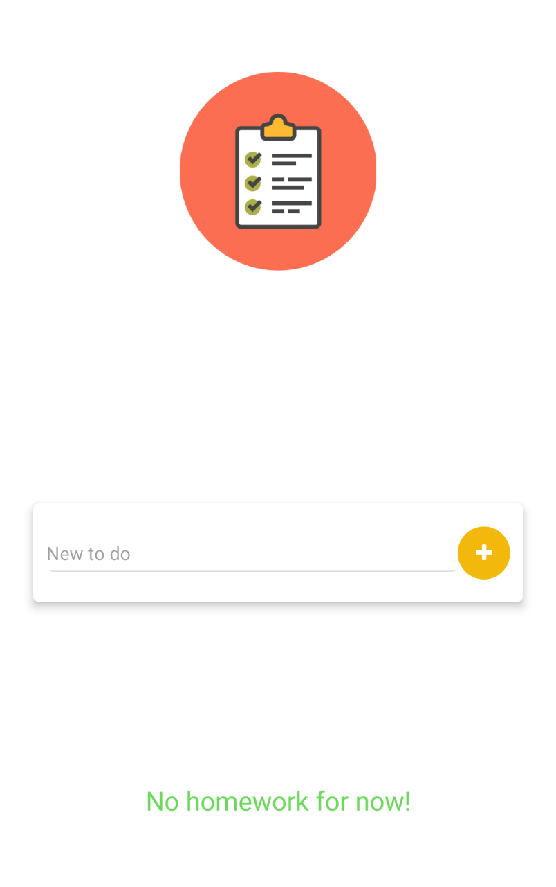
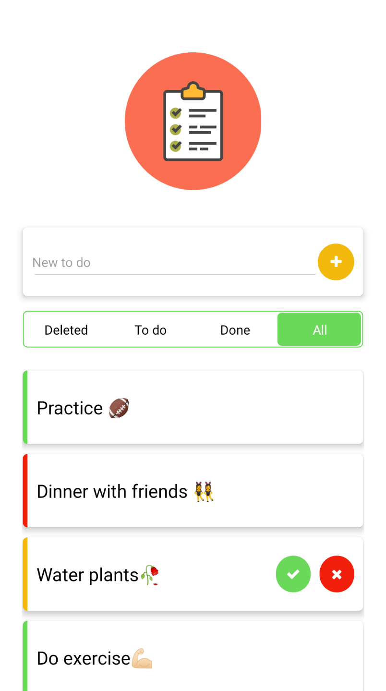

# React Native to do list aplication

This is a sample calculator app built with React Native for sole purposes of learning the ReactNative framework and practice different methods on building a mobile app.

When is empty

All homeworks

You can run this! 

<a href="https://exp.host/@adivianahd/todo-list-app">Link here!</a>

